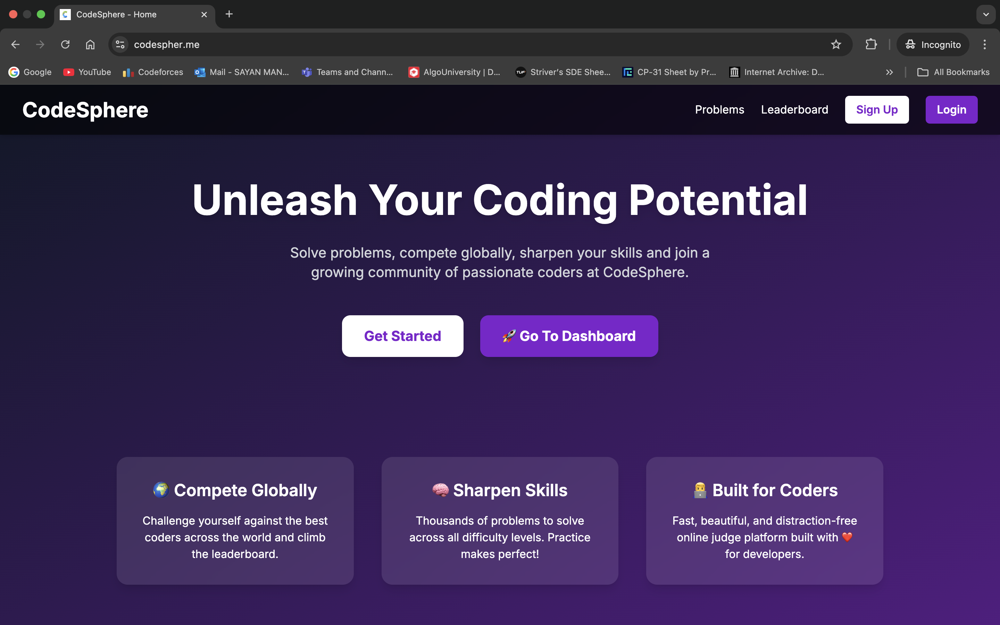
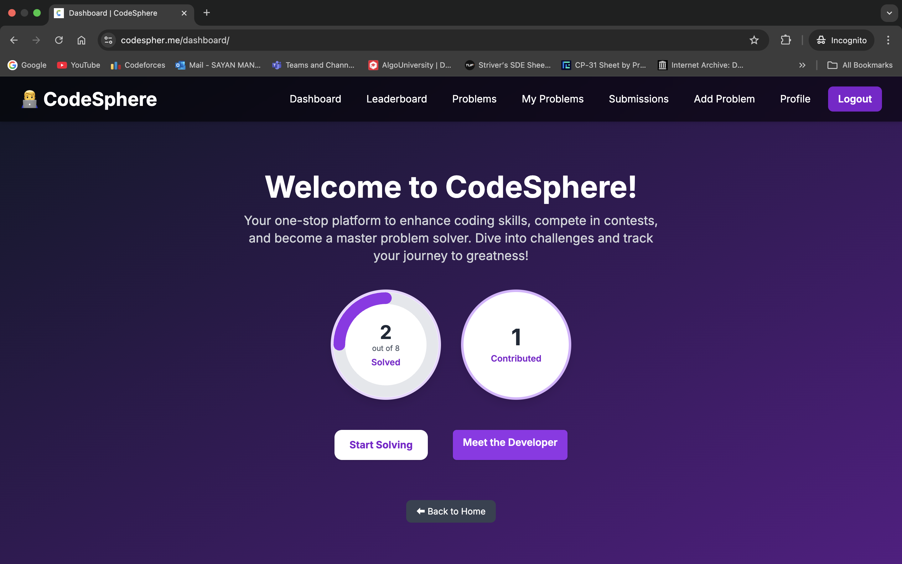
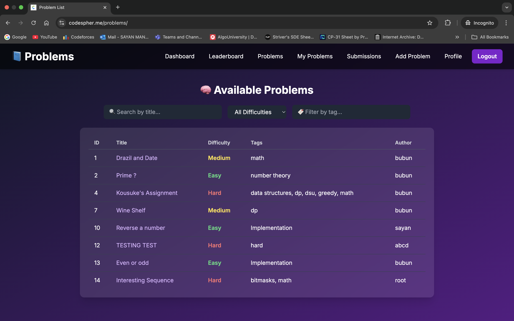
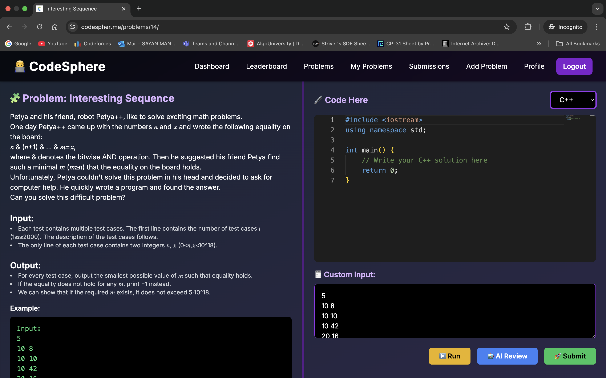
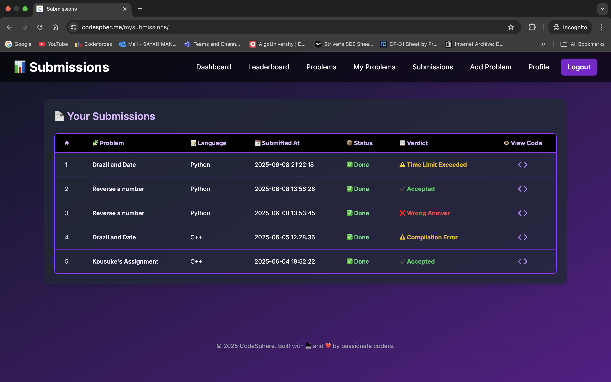

# 🧑‍⚖️ CodeSphere - Online Coding Platform
🔗 [Live Website](https://www.codespher.me)  
🎥 [Live Demo Video](https://www.loom.com/share/6e6c058402d240bcab52e2c7ff3ca1b5?sid=cf73ad9e-9228-49f4-b8c9-da2b8025a3ec)


CodeSphere is a web application that allows users to solve programming problems, compile code online, submit solutions for automated evaluation, and add problems — similar to platforms like Codeforces and LeetCode.

---
## 🖼️ Screenshots

### 🏠 Home Page   


### 📊 Dashboard Page 


### 📄 Problem Page  


### 💻 Code Area  


### 📑 Submission Page  



---
## 📁 Project Structure
---
```bash
OJ/
├── backend/           # Django backend (views, models, admin)
├── accounts/          # Handles user registration and login
├── problem/           # Problem models and views
├── submission/        # Submission logic and code evaluation
├── media/             # Uploaded test case files
├── templates/         # Frontend HTML templates
├── db.sqlite3         # SQLite database file
├── Dockerfile         # Docker configuration
├── requirements.txt   # Python dependencies
└── manage.py          # Django management script
```

## ⚙️ Tech Stack

- **Backend:** Django (Python)
- **Frontend:** HTML/CSS/JavaScript
- **Database:** SQLite3 (for development)
- **Containerization:** Docker
- **Cloud Hosting:** AWS EC2 (Amazon Web Services)
- **DevOps:** Docker Hub (for image storage)
- **Others:** Git, GitHub
---

## 🚀 Features

- User registration and login (email/password)
- Online code compilation (with support for multiple languages)
- Submit solutions and get verdicts (Accepted, Wrong Answer, TLE, Compilation Error etc.)
- Admin panel for problem management
- Custom test case evaluation
- Submission history and results

---
## 🎥 Live Demo

Check out a quick demo of CodeSphere in action:  
👉 [Watch the demo video here](https://www.loom.com/share/6e6c058402d240bcab52e2c7ff3ca1b5?sid=69f12c30-e11b-4f6b-855d-496de3cf566f)


## 🛠️ Setup Instructions from GitHub
> **Note:** Python 3.9+ is recommended.

```bash
git clone https://github.com/codesayan2004/OJ.git
cd OJ
python -m venv myenv
source myenv/bin/activate
cd backend
pip install -r requirements.txt
python manage.py migrate
python manage.py runserver
```
## 🛠️ Setup Instructions from DockerHub

```bash
docker pull sayan2004/codesphere
docker run -d -p 8000:8000 sayan2004/codesphere
```
Then open:
➡️ http://localhost:8000

## 📄 License

This project is currently not licensed. Feel free to explore and suggest improvements.

## 🤝 Contributing

Contributions, issues and feature requests are welcome! Feel free to open issues or submit pull requests.
